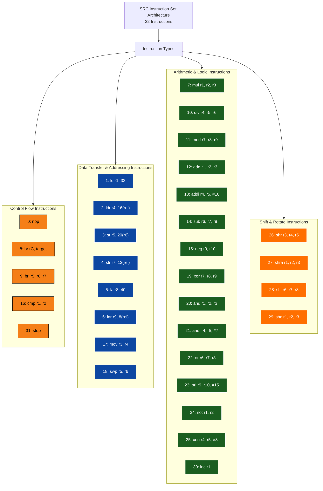

# COA-Assign

| Opcode | Instruction | Form | Binary | Hex | Type |
|--------|-------------|------|--------|-----|------|
| 0 | nop | nop | 00000 00000 00000 00000 000000000000 | 0x00000000 | Control |
| 1 | ld | ld r3, 32 | 00001 00011 00000 00000 000000100000 | 0x08600020 | Data |
| 2 | ldr | ldr r5, 8 | 00010 00101 00000 00000 000000001000 | 0x11400008 | Data |
| 3 | st | st r4, 0(r9) | 00011 00100 01001 00000 000000000000 | 0x19240000 | Data |
| 4 | str | str r7, 12 | 00100 00111 00000 00000 000000001100 | 0x21C0000C | Data |
| 5 | la | la r7, 32 | 00101 00111 00000 00000 000000100000 | 0x29C00020 | Data |
| 6 | lar | lar r6, 45 | 00110 00110 00000 00000 000000101101 | 0x3180002D | Data |
| 7 | mul | **mul r0, r2, r4** | 00111 **00000 00010 00100** 000000000000 | 0x38044000 | ALU |
| 8 | br | **br r4** | 01000 **00000 00100 00000** 000000000**001** | 0x40080001 | Control |
| 9 | brl | **brl r6, r4** | 01001 **00110 00100 00000** 000000000**001** | 0x49880001 | Control |
| 10 | div | **div r4, r5, r6** | 01010 **00100 00101 00110** 000000000000 | 0x5084C000 | ALU |
| 11 | mod | **mod r7, r8, r9** | 01011 **00111 01000 01001** 000000000000 | 0x5BC89000 | ALU |
| 12 | add | add r0, r2, r4 | 01100 00000 00010 00100 000000000000 | 0x60044000 | ALU |
| 13 | addi | addi r2, r4, #1 | 01101 00010 00100 00000 000000000001 | 0x68880001 | ALU |
| 14 | sub | sub r3, r4, r5 | 01110 00011 00100 00101 000000000000 | 0x70C8A000 | ALU |
| 15 | neg | neg r7, r9 | 01111 00111 00000 01001 000000000000 | 0x79C12000 | ALU |
| 16 | cmp | **cmp r1, r2** | **10000 00001 00010 00000** 000000000000 | **0x80440000** | **ALU** |
| 17 | mov | **mov r3, r4** | **10001 00011 00100 00000** 000000000000 | **0x88C80000** | Data |
| 18 | swp | **swp r5, r6** | **10010 00101 00110 00000** 000000000000 | **0x914C0000** | Data |
| 19 | xor | **xor r7, r8, r9** | **10011 00111 01000 01001** 000000000000 | **0x9BE12000** | ALU |
| 20 | and | and r1, r2, r3 | 10100 00001 00010 00011 000000000000 | 0xA0446000 | ALU |
| 21 | andi | andi r1, r2, #128 | 10101 00001 00010 00000 000000100000 | 0xA8440020 | ALU |
| 22 | or | or r2, r5, r6 | 10110 00010 00101 00110 000000000000 | 0xB08B4000 | ALU |
| 23 | ori | ori r3, r1, #7 | 10111 00011 00001 00000 000000000111 | 0xB8C20007 | ALU |
| 24 | not | not r2, r3 | 11000 00010 00000 00011 000000000000 | 0xC0406000 | ALU |
| 25 | xori | **xori r4, r5, #3** | **11001 00100 00101 00000** 000000000011 | **0xC90A0003** | ALU |
| 26 | shr | shr r0, r1, #4 | 11010 00000 00001 00000 000000000100 | 0xD0002004 | Shift |
| 27 | shra | shra r1, r2, r3 | 11011 00001 00010 00011 000000000000 | 0xD8446000 | Shift |
| 28 | shl | shl r2, r4, r6 | 11100 00010 00100 00110 000000000000 | 0xE088C000 | Shift |
| 29 | shc | shc r1, r2, r3 | 11101 00001 00010 00011 000000000000 | 0xE8446000 | Shift |
| 30 | inc | **inc r1** | **11110 00001 00000 00000** 000000000001 | **0xF8200001** | ALU |
| 31 | stop | stop | 11111 00000 00000 00000 000000000000 | 0xF8000000 | Control |

```mermaid
flowchart LR
    A[SRC Instruction Set - Full 32 Unique Opcodes] --> B0[Opcode 0: nop]
    B0 --> B0a["Form: nop"]
    B0a --> B0a1["Binary: 00000 00000 00000 00000 000000000000"]
    B0a --> B0a2["Hex: 0x00000000"]

    A --> B1[Opcode 1: ld]:::data
    B1 --> B1a["Form: ld r1, 32"]
    B1a --> B1a1["Binary: 00001 00001 00000 00000 000001000000"]
    B1a --> B1a2["Hex: 0x08400020"]

    A --> B2[Opcode 2: ldr]:::data
    B2 --> B2a["Form: ldr r4, 16 (relative)"]
    B2a --> B2a1["Binary: 00010 00100 00000 00000 000000010000"]
    B2a --> B2a2["Hex: 0x11000010"]

    A --> B3[Opcode 3: st]:::data
    B3 --> B3a["Form: st r5, 20(r6)"]
    B3a --> B3a1["Binary: 00011 00101 00110 00000 000000010100"]
    B3a --> B3a2["Hex: 0x194C0014"]

    A --> B4[Opcode 4: str]:::data
    B4 --> B4a["Form: str r7, 12 (relative)"]
    B4a --> B4a1["Binary: 00100 00111 00000 00000 000000001100"]
    B4a --> B4a2["Hex: 0x21C0000C"]

    A --> B5[Opcode 5: la]:::data
    B5 --> B5a["Form: la r8, 40"]
    B5a --> B5a1["Binary: 00101 01000 00000 00000 000000101000"]
    B5a --> B5a2["Hex: 0x2A000028"]

    A --> B6[Opcode 6: lar]:::data
    B6 --> B6a["Form: lar r9, 8 (relative)"]
    B6a --> B6a1["Binary: 00110 01001 00000 00000 000000001000"]
    B6a --> B6a2["Hex: 0x32400008"]

    A --> B7[Opcode 7: mul]:::alu
    B7 --> B7a["Form: mul r1, r2, r3"]
    B7a --> B7a1["Binary: 00111 00001 00010 00011 000000000000"]
    B7a --> B7a2["Hex: 0x38043000"]

    A --> B8[Opcode 8: br]:::ctrl
    B8 --> B8a["Form: br r2 (always)"]
    B8a --> B8a1["Binary: 01000 00000 00010 00000 000000000001"]
    B8a --> B8a2["Hex: 0x40040001"]

    A --> B9[Opcode 9: brl]:::ctrl
    B9 --> B9a["Form: brl r5, r6, r7"]
    B9a --> B9a1["Binary: 01001 00101 00110 00111 000000000001"]
    B9a --> B9a2["Hex: 0x494C7001"]

    A --> B10[Opcode 10: div]:::alu
    B10 --> B10a["Form: div r4, r5, r6"]
    B10a --> B10a1["Binary: 01010 00100 00101 00110 000000000000"]
    B10a --> B10a2["Hex: 0x50A45000"]

    A --> B11[Opcode 11: mod]:::alu
    B11 --> B11a["Form: mod r7, r8, r9"]
    B11a --> B11a1["Binary: 01011 00111 01000 01001 000000000000"]
    B11a --> B11a2["Hex: 0x5BC89000"]

    A --> B12[Opcode 12: add]:::alu
    B12 --> B12a["Form: add r1, r2, r3"]
    B12a --> B12a1["Binary: 01100 00001 00010 00011 000000000000"]
    B12a --> B12a2["Hex: 0x60443000"]

    A --> B13[Opcode 13: addi]:::alu
    B13 --> B13a["Form: addi r4, r5, #10"]
    B13a --> B13a1["Binary: 01101 00100 00101 00000 000000001010"]
    B13a --> B13a2["Hex: 0x690A000A"]

    A --> B14[Opcode 14: sub]:::alu
    B14 --> B14a["Form: sub r6, r7, r8"]
    B14a --> B14a1["Binary: 01110 00110 00111 01000 000000000000"]
    B14a --> B14a2["Hex: 0x718E8000"]

    A --> B15[Opcode 15: neg]:::alu
    B15 --> B15a["Form: neg r9, r10"]
    B15a --> B15a1["Binary: 01111 01001 00000 01010 000000000000"]
    B15a --> B15a2["Hex: 0x7A40A000"]

    A --> B16[Opcode 16: cmp]:::ctrl
    B16 --> B16a["Form: cmp r1, r2"]
    B16a --> B16a1["Binary: 10000 00001 00010 00000 000000000000"]
    B16a --> B16a2["Hex: 0x80420000"]

    A --> B17[Opcode 17: mov]:::data
    B17 --> B17a["Form: mov r3, r4"]
    B17a --> B17a1["Binary: 10001 00011 00100 00000 000000000000"]
    B17a --> B17a2["Hex: 0x88C40000"]

    A --> B18[Opcode 18: swp]:::data
    B18 --> B18a["Form: swp r5, r6"]
    B18a --> B18a1["Binary: 10010 00101 00110 00000 000000000000"]
    B18a --> B18a2["Hex: 0x914C6000"]

    A --> B19[Opcode 19: xor]:::alu
    B19 --> B19a["Form: xor r7, r8, r9"]
    B19a --> B19a1["Binary: 10011 00111 01000 01001 000000000000"]
    B19a --> B19a2["Hex: 0x9BC89000"]

    A --> B20[Opcode 20: and]:::alu
    B20 --> B20a["Form: and r1, r2, r3"]
    B20a --> B20a1["Binary: 10100 00001 00010 00011 000000000000"]
    B20a --> B20a2["Hex: 0xA0443000"]

    A --> B21[Opcode 21: andi]:::alu
    B21 --> B21a["Form: andi r4, r5, #7"]
    B21a --> B21a1["Binary: 10101 00100 00101 00000 000000000111"]
    B21a --> B21a2["Hex: 0xA90A0007"]

    A --> B22[Opcode 22: or]:::alu
    B22 --> B22a["Form: or r6, r7, r8"]
    B22a --> B22a1["Binary: 10110 00110 00111 01000 000000000000"]
    B22a --> B22a2["Hex: 0xB18E8000"]

    A --> B23[Opcode 23: ori]:::alu
    B23 --> B23a["Form: ori r9, r10, #15"]
    B23a --> B23a1["Binary: 10111 01001 01010 00000 000000001111"]
    B23a --> B23a2["Hex: 0xBA54000F"]

    A --> B24[Opcode 24: not]:::alu
    B24 --> B24a["Form: not r1, r2"]
    B24a --> B24a1["Binary: 11000 00001 00000 00010 000000000000"]
    B24a --> B24a2["Hex: 0xC0402000"]

    A --> B25[Opcode 25: xori]:::alu
    B25 --> B25a["Form: xori r4, r5, #3"]
    B25a --> B25a1["Binary: 11001 00100 00101 00000 000000000011"]
    B25a --> B25a2["Hex: 0xC90A0003"]

    A --> B26[Opcode 26: shr]:::shift
    B26 --> B26a["Form: shr r3, r4, r5"]
    B26a --> B26a1["Binary: 11010 00011 00100 00101 000000000000"]
    B26a --> B26a2["Hex: 0xD0C85000"]

    A --> B27[Opcode 27: shra]:::shift
    B27 --> B27a["Form: shra r1, r2, r3"]
    B27a --> B27a1["Binary: 11011 00001 00010 00011 000000000000"]
    B27a --> B27a2["Hex: 0xD8443000"]

    A --> B28[Opcode 28: shl]:::shift
    B28 --> B28a["Form: shl r6, r7, r8"]
    B28a --> B28a1["Binary: 11100 00110 00111 01000 000000000000"]
    B28a --> B28a2["Hex: 0xE18E8000"]

    A --> B29[Opcode 29: shc]:::shift
    B29 --> B29a["Form: shc r1, r2, r3"]
    B29a --> B29a1["Binary: 11101 00001 00010 00011 000000000000"]
    B29a --> B29a2["Hex: 0xE8443000"]

    A --> B30[Opcode 30: inc]:::alu
    B30 --> B30a["Form: inc r1"]
    B30a --> B30a1["Binary: 11110 00001 00000 00000 000000000001"]
    B30a --> B30a2["Hex: 0xF8000001"]

    A --> B31[Opcode 31: stop]
    B31 --> B31a["Form: stop"]
    B31a --> B31a1["Binary: 11111 00000 00000 00000 000000000000"]
    B31a --> B31a2["Hex: 0xF8000000"]

    classDef data fill:#0d47a1,stroke:#ffffff,color:#ffffff;
    classDef alu fill:#1b5e20,stroke:#ffffff,color:#ffffff;
    classDef ctrl fill:#f57f17,stroke:#000000,color:#000000;
    classDef shift fill:#ff6f00,stroke:#ffffff,color:#ffffff;
    style A fill:#000000,stroke:#ffffff,color:#ffffff,font-weight:bold
    style B0 fill:#212121,stroke:#ffffff,color:#ffffff,font-weight:bold
    style B1 fill:#0d47a1,stroke:#ffffff,color:#ffffff,font-weight:bold

```

